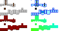

# Fancy Pants Lite
A vanilla shader to create custom armor textures

## Texture Format
The shader is made to take the **same format** that is used by [fancyPants](https://github.com/Ancientkingg/fancyPants) by AncientKingg but will give a lot better performance

If you are already using fancyPants and are not using emissivity or animations, it should suffice if you simply replace the [`shaders/core`](assets/minecraft/shaders/core/) folder

[](assets/minecraft/textures/models/armor/leather_layer_1.png)
[](assets/minecraft/textures/models/armor/leather_layer_2.png)

- The pixel **1 down from the top left corner** should always be white (`#FFFFFF`) at maximum opacity

- Each armor texture has to be **64 pixels wide** and **32 pixels high**, the individual textures can be stacked **next to each other** and/or **above each other**

- The **top left pixel of each texture** should be the **same color** the leather armor has **in-game**

You can try out the textures provided in the template pack by giving yourself the armor with the following commands:
```mcfunction
give @s leather_helmet{display:{color:9983}}
give @s leather_chestplate{display:{color:9983}}
give @s leather_leggings{display:{color:9983}}
give @s leather_boots{display:{color:9983}}

give @s leather_helmet{display:{color:9983}}
give @s leather_chestplate{display:{color:9983}}
give @s leather_leggings{display:{color:9983}}
give @s leather_boots{display:{color:9983}}

give @s leather_helmet{display:{color:9983}}
give @s leather_chestplate{display:{color:9983}}
give @s leather_leggings{display:{color:9983}}
give @s leather_boots{display:{color:9983}}
```

## What it can't do
- This shader doesn't provide a way to make armor emissive

- This shader doesn't animate any armor

- Like with fancyPants, the glowing effect on any entity wearing leather or custom armor looks a little weird

If you are looking for a shader that has even better performance and works with the glowing effect (but has other drawbacks), make sure to take a look at [lessFancyPants](https://github.com/Godlander/lessfancypants) by Godlander

---
Check me out on other platforms:

<a href="https://github.com/PuckiSilver" target="_blank">
  
</a>
<a href="https://modrinth.com/user/PuckiSilver" target="_blank">
  
</a>
<a href="https://www.planetminecraft.com/member/puckisilver" target="_blank">
  
</a>
